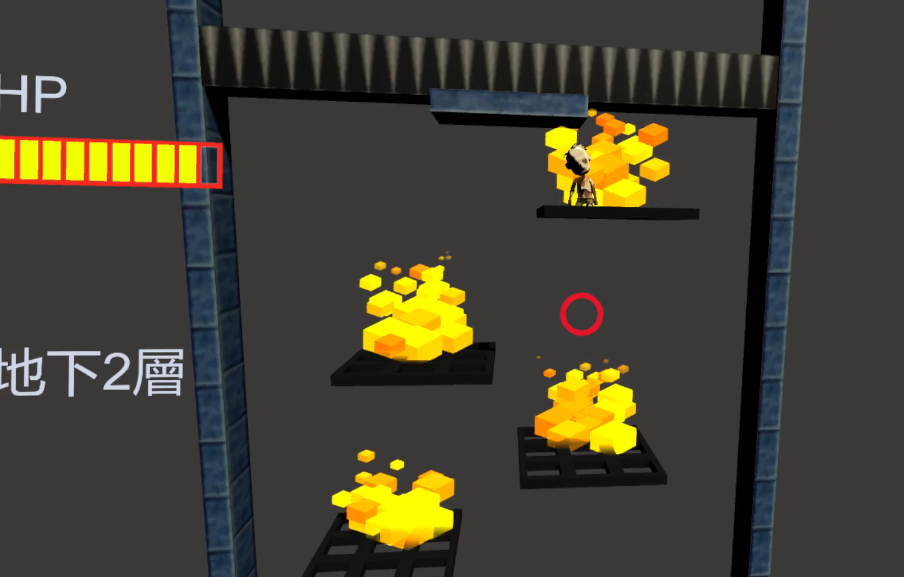

# 🧟 殭屍下階梯 VR 遊戲

經典 2D 小朋友下樓梯遊戲的 VR 重製版。玩家透過擺動頭部，即可在 VR 環境中操控角色左右移動、閃避、下樓，享受更具沉浸感與挑戰性的 3D 遊戲體驗。

---

## 📌 遊戲特色
- 🎮 將 2D 遊戲轉換為 3D VR 遊戲，提升視覺臨場感
- 🧠 玩家使用頭部擺動控制角色左右移動，無需手把
- 🧱 階梯隨機生成，搭配不同樣式與陷阱增加可玩性
- ❤️ 血量條與樓層紀錄，挑戰更高分數與更遠距離
- 📱 相容 Google Cardboard，支援手機裝置進行 VR 體驗

---

## 🔧 使用技術與工具

| 類別     | 技術/工具                   |
|----------|------------------------------|
| 程式語言 | C#                           |
| 遊戲引擎 | Unity                        |
| VR 支援  | Google VR SDK for Unity      |
| 裝置支援 | Google Cardboard / Android   |
| 開發工具 | Unity Hub                    |

---

## 🚀 系統架構與功能模組

### 🎲 遊戲流程
1. 進入 VR 遊戲畫面後，角色站在階梯最上層
2. 玩家透過擺頭進行左右移動
3. 隨機生成階梯（含空格、陷阱）
4. 當角色碰撞陷阱則扣血，掉落或血量歸零即結束遊戲

### 🔄 動態元素
- 階梯類型：
  - 正常階梯
  - 火焰階梯
- 記錄血量與層數

---

## 📷 畫面展示

- 遊玩畫面 
  
  
- 重新畫面 
  
- 電腦畫面 
  
- 手機畫面 
  

---

📌 **主要腳本位置：** [`Assets/Supercyan Character Pack Zombie Sample/Scripts/`](Assets/Supercyan%20Character%20Pack%20Zombie%20Sample/Scripts/)

